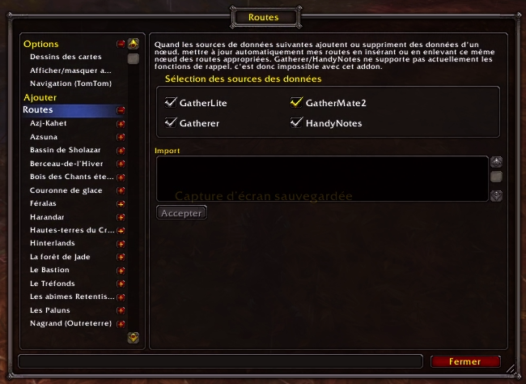
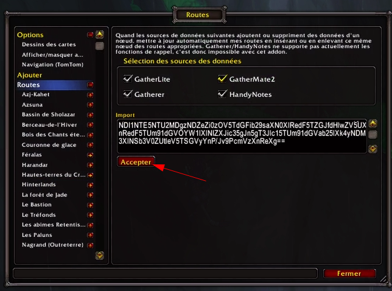
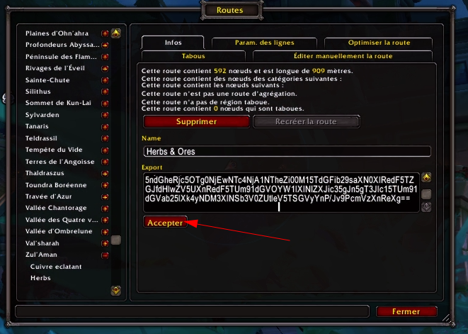

# Midnight Routes

Regroupement de routes optimisée de récoltes à partir des coordonnées fournies par Wowhead. Pour chaque zone, vous trouverez les routes de chaque plantes / gisements, ainsi que des routes aggrégeant chaque plante, chaque gisements, ou les deux en même temps.

## Utilisation

### Importation d'une nouvelle route

* Installez les addons [Routes](https://www.curseforge.com/wow/addons/routes) et [Routes Import/Export](https://www.curseforge.com/wow/addons/routes-import-export)

* Tapez /routes dans le chat pour ouvrir les paramètres de Routes

* Cliquez sur Routes

* Sélectionnez une route que vous souhaitez importer depuis le repository, comme [la route `Herbs & Ores` de Zul'Aman](Zul'Aman/herbs_and_ores.txt)

* Copiez le contenu et collez-le dans la zone de texte Importer, puis cliquez sur Accepter

### Mise à jour d'une route existante

Pour mettre à jour une route existante, sélectionnez la route que vous souhaitez mettre à jour dans les options de routes en faisant `/routes`, puis cliquez sur Accepter

